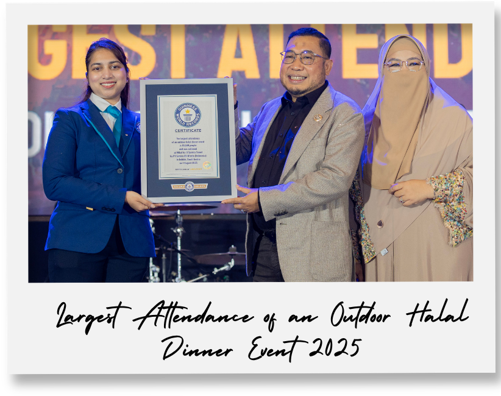
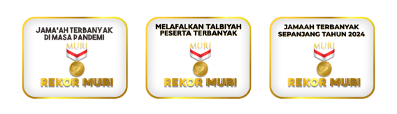
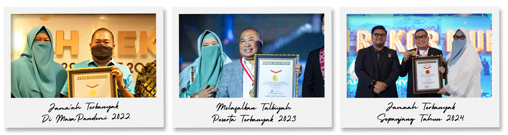
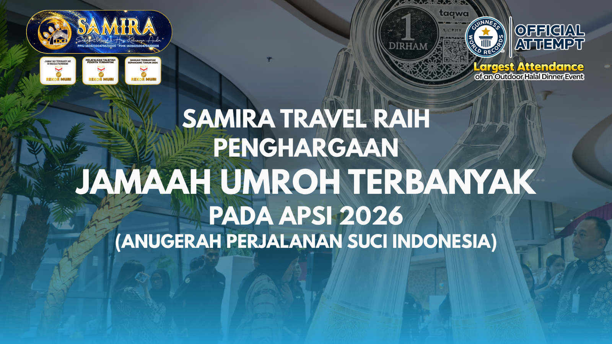

# Profil Perusahaan, Sejarah & Penghargaan Resmi Samira Travel (PT Samira Ali Wisata)

Dokumen ini memuat profil korporasi menyeluruh, sejarah pendirian, latar belakang pendiri, legalitas resmi pemerintah Republik Indonesia, akreditasi, integrasi SISKOPATUH Kementerian Agama RI, rekor dunia (*Guinness World Records*), tiga Rekor MURI, penghargaan industri (APSI 2026), serta akun perbankan resmi **PT Samira Ali Wisata (Samira Travel)**.

Seluruh data telah divalidasi silang (*cross-referenced*) antara portal resmi `samiratravel.co.id`, pangkalan data Kementerian Agama RI (SIMPU/SISKOPATUH), BKPM OSS RBA, asosiasi resmi (HIMPUH & ASITA), basis data *Guinness World Records*, serta arsip Museum Rekor Dunia-Indonesia (MURI).

---

## 1. Identitas Badan Hukum & Kredensial Regulasi Resmi

| Parameter Legalitas | Data Faktual Resmi Terverifikasi |
|:---|:---|
| **Nama Badan Hukum** | **PT Samira Ali Wisata** |
| **Merek Dagang Resmi** | **Samira Travel** |
| **Nomor Induk Berusaha (NIB)** | **`1609210047562`** (OSS BKPM Berbasis Risiko) |
| **Izin Operasional Perizinan Berusaha** | **`16092100475620005`** (KBLI 79122 - Aktivitas Biro Perjalanan Wisata) |
| **Izin Resmi PPIU (Umroh)** | **SK Menteri Agama RI No. 137 Tahun 2020** *(Pembaruan dari SK Dirjen PHU Kemenag No. D/834 Tahun 2016)* |
| **Izin Resmi PIHK (Haji Khusus)** | **SK Menteri Agama RI No. `16092100475620002`** *(Diterbitkan 25 Februari 2022)* |
| **Peringkat Akreditasi** | **Akreditasi A (Unggul / Sangat Baik)** berdasarkan audit standar PMA No. 8/2018 Kemenag RI |
| **Keanggotaan HIMPUH** | No. Registrasi: **`H.102-01 Tahun 2020`** *(Terdaftar sejak 16 Januari 2020)* |
| **Keanggotaan ASITA** | No. Anggota: **`NIA 1259/VIII/DPP/07`** |
| **Integrasi Sistem Pemerintah** | Terhubung langsung dengan **SISKOPATUH Kemenag RI** (Penerbitan Nomor Porsi Umroh / NPU resmi) |
| **Alamat Kantor Pusat** | Jl. Malaka Merah No.7/6, Pondok Kopi, Kec. Duren Sawit, Kota Jakarta Timur, DKI Jakarta 13460 |
| **Kontak Layanan Resmi** | `0856-0717-9735` (Telepon & WhatsApp) |
| **Email & Website** | `samiratravelsurabayaterpercaya@gmail.com` / `https://www.samiratravel.co.id` |

---

## 2. Sejarah, Asal-Usul & Garis Waktu Perkembangan (Milestones)

Samira Travel berakar dari gerakan syiar kemitraan dakwah dan kewirausahaan yang dimulai pada tahun 2014 di bawah bendera **Dini Group Indonesia (DGi)**.

### Garis Waktu Evolusi Perusahaan (2014 – 2026):
- **2014 – 2016 (Era Inkubasi DGi & Akuisisi Legalitas)**:
  - Berawal dari komunitas kemitraan keagenan travel umroh yang diinisiasi oleh H. Fauzi Wahyu Muntoro dan Hj. drg. Dini Lukitasari.
  - Maraknya kasus penipuan travel umroh tak berizin di Indonesia mendorong pendiri untuk memiliki entitas resmi berizin penuh di Kemenag RI. Dilakukan langkah strategis akuisisi dan perizinan badan hukum **PT Samira Ali Wisata**, mengantongi SK Dirjen PHU No. D/834 Tahun 2016.
- **2016 – 2019 (Membangun Ekosistem Keagenan Nasional)**:
  - Mengembangkan sistem kemitraan keagenan *"Pejuang Baitullah"* di seluruh provinsi Indonesia.
  - Menerapkan inovasi skema *block seat pesawat* dan *booking hotel terlebih dahulu*, memutus rantai ketidakpastian tanggal keberangkatan yang kerap dialami biro umroh konvensional.
- **2020 (Pembaruan SK PPIU & Ketangguhan Pandemi Covid-19)**:
  - Memperbarui izin operasional melalui SK Menag No. 137 Tahun 2020.
  - Ketika industri travel global kolaps akibat pandemi Covid-19, Samira Travel menjadi salah satu dari segelintir biro perjalanan Indonesia yang berhasil memberangkatkan jamaah di era awal pembukaan umroh *new normal* dengan protokol kesehatan ketat tanpa ada jamaah yang terlantar. Prestasi ini dianugerahi **Rekor MURI** pertama.
- **2022 – 2024 (Ekspansi & Dominasi Peringkat 1 Nasional)**:
  - Memperoleh izin resmi Penyelenggara Ibadah Haji Khusus (PIHK) pada 25 Februari 2022.
  - Berdasarkan rekapitulasi sistem resmi **SISKOPATUH Kementerian Agama RI** periode 1 Januari – 20 Desember 2024: Samira Travel dinobatkan sebagai **Peringkat #1 Nasional** dari 2.625 PPIU di seluruh Indonesia dengan memberangkatkan **28.673 jamaah** (tercatat audit final MURI mencapai **29.171 jamaah**).
- **1 Agustus 2025 (Pencatatan Rekor Dunia di Jeddah)**:
  - Menggelar acara makan malam halal terbuka akbar (*Milad ke-9*) di Asfan, Jeddah, Arab Saudi yang dihadiri oleh **10.449 jamaah**, diverifikasi resmi oleh juri *Guinness World Records*.
- **7 Juni 2026 (Milad 1 Dekade - "Samira Untuk Semesta" di ICE BSD)**:
  - Perayaan akbar satu dekade (10 tahun) kiprah Samira Travel di Indonesia Convention Exhibition (ICE) BSD City, Tangerang.
  - Dihadiri puluhan ribu jamaah dan mitra perwakilan dari Aceh hingga Papua, didukung oleh Brand Ambassador resmi (Band UNGU, Citra Kirana, dan Rezky Adhitya), serta penyerahan resmi piagam *Guinness World Records*.
- **5 September 2026 (Penghargaan APSI 2026)**:
  - Meraih penghargaan bergengsi dalam ajang **Anugerah Perjalanan Suci Indonesia (APSI) 2026** yang dihelat oleh tvOne (VIVA Group) untuk kategori *Kinerja Operasional - Jemaah Umroh Terbanyak*.

---

## 3. Profil Pendiri & Tokoh Kunci Manajemen

### A. H. Fauzi Wahyu Muntoro, S.E. (Founder & Direktur Utama / CEO)
- **Profil Akademis & Karir**:
  - Lahir dan besar di Karanganyar, Solo Raya, Jawa Tengah (Alumni SMA Muhammadiyah 1 Karanganyar 1991–1994).
  - Meraih gelar Sarjana Ekonomi (S.E.) dan pernah mendedikasikan diri sebagai **Dosen di Universitas Indonesia (UI)** selama kurang lebih 10 tahun sebelum terjun penuh sebagai wirausahawan syariah.
  - Memiliki pengalaman bisnis multisektor, mulai dari klinik tumbuh kembang anak, pasokan alat kesehatan rumah sakit, peternakan modern (Samira Farm), hingga industri pariwisata halal.
- **Peran di Perusahaan**:
  - Direktur Utama PT Samira Ali Wisata dan Chairman PT Dini Group Indonesia (DGi).
  - Penggagas terobosan skema pembiayaan syariah *"Umroh Dulu, Bayar Belakangan"* bersama lembaga keuangan resmi, memfasilitasi umat muslim yang ingin beribadah tanpa terhalang pembayaran tunai di muka.
- **Kontribusi Sosial & Keumatan**:
  - Inisiator pembangunan **Masjid Abdurrahman bin Auf Samira (MABES)** di Cangakan, Karanganyar (diresmikan November 2023) sebagai pusat dakwah dan manasik umat.
  - Pendiri *Crown Boarding School* (lembaga pendidikan tahfidz Al-Qur'an terpadu di Karanganyar).
  - Aktif dalam kepemimpinan organisasi kemasyarakatan dan kebangsaan (Wakil Ketua Bangter III DPN Partai Gelora Indonesia).

### B. Hj. drg. Dini Lukitasari (Co-Founder & Komisaris Utama)
- **Latar Belakang Profesional**:
  - Berlatar belakang tenaga medis profesional sebagai **Dokter Gigi (drg.)**. Nama beliau diabadikan sebagai nama induk perusahaan: **Dini Group Indonesia (DGi)**.
- **Peran di Perusahaan**:
  - Komisaris Utama PT Samira Ali Wisata.
  - Memimpin divisi pembinaan jamaah wanita, edukasi kesehatan jamaah keluarga/lansia, serta program pemberdayaan ekonomi perempuan melalui jaringan kemitraan *Pejuang Baitullah*.
  - Rutin mendampingi jamaah di Tanah Suci Makkah dan Madinah dalam membimbing manasik khusus keluarga.

### C. Brand Ambassador & Figur Publik Pendukung
- **Ungu Band (Pasha Ungu, Enda, Oncy, Makki, Rowman)**:
  - Brand Ambassador resmi Samira Travel dalam momentum Milad Satu Dekade. Mengapresiasi integritas Samira Travel yang telah memberangkatkan ratusan ribu jamaah Indonesia secara amanah.
- **Citra Kirana & Rezky Adhitya**:
  - Pasangan selebriti yang menjadi Brand Ambassador keluarga, memimpin program keberangkatan akbar **UMBAST (Umroh Bareng Satu Pesawat)** langsung ke Madinah.

---

## 4. Rekor Dunia & Penghargaan Nasional Terverifikasi

### A. Guinness World Records (Rekor Dunia)

- **Judul Rekor Resmi**: ***"Largest attendance of an outdoor halal dinner event"***
- **Nomor Referensi Pangkalan Data GWR**: **`15-782573`**
- **Tautan Verifikasi Resmi**: `https://www.guinnessworldrecords.com/world-records/782573-largest-attendance-of-an-outdoor-halal-dinner-event`
- **Entitas Pemegang Rekor**: PT Samira Ali Wisata (Indonesia)
- **Jumlah Peserta Terverifikasi**: **10.449 orang**
- **Tanggal Pemecahan Rekor**: **1 Agustus 2025**
- **Lokasi Acara**: Area terbuka padang pasir di **Asfan, Jeddah, Kerajaan Arab Saudi**
- **Konteks & Penjurian**: Diselenggarakan dalam rangka Milad ke-9 Samira Travel. Dinilai secara ketat oleh juri resmi Guinness World Records melalui verifikasi *turnstile headcount*, sertifikasi penyajian makanan halal berstandar higiene internasional, dan manajemen massa. Piagam diserahkan secara megah pada Milad Satu Dekade di ICE BSD City tanggal 7 Juni 2026.
### B. Tiga Rekor MURI (Museum Rekor Dunia-Indonesia)
1. **Rekor MURI: Keberangkatan Jamaah Terbanyak di Masa Pandemi (2020 – 2022)**
   
   - *Kategori*: Penyelenggara Perjalanan Ibadah Umrah yang Memberangkatkan Jemaah Terbanyak Selama Masa Pandemi Covid-19.
   - *Jumlah Terverifikasi*: **8.176 jamaah**.
   - *Tanggal & Tempat Penyerahan*: 29 Maret 2022 di Inna Grand Bali Beach, Sanur, Denpasar, Bali.
   - *Pejabat MURI*: Diserahkan langsung oleh Andrew Purwandono (Customer Relations Manager MURI).
2. **Rekor MURI: Pembacaan Lafal Talbiyah Bersama Peserta Terbanyak (2023)**
   
   - *Kategori*: Pembacaan Lafal Talbiyah Bersama oleh Peserta Terbanyak.
   - *Jumlah Terverifikasi*: **5.600 peserta**.
   - *Tanggal & Tempat*: 23 Juli 2023 di Sentul International Convention Center (SICC), Bogor, Jawa Barat.
   - *Pejabat MURI*: Diserahkan oleh Triyono (Senior Manager MURI) dalam perayaan Milad ke-7 Samira Travel.
3. **Rekor MURI: Jamaah Umroh Terbanyak Sepanjang Tahun 2024**
   
   - *Kategori*: Biro Perjalanan Ibadah Umrah dengan Pemberangkatan Jemaah Terbanyak Sepanjang Tahun 2024.
   - *Jumlah Terverifikasi*: **29.171 jamaah** *(angka awal per 20 Desember 2024 di Siskopatuh tercatat 28.673 jamaah; konsolidasi audit final MURI tervalidasi 29.171 jamaah)*.
   - *Tanggal & Tempat Penyerahan*: 19 Juli 2025 di Ballroom Hotel Mercure Batavia, Jakarta Barat.
### C. Anugerah Perjalanan Suci Indonesia (APSI) 2026

- *Penyelenggara*: **tvOne (PT Lativi Mediakarya / VIVA Group)**
- *Waktu Penganugerahan*: **5 September 2026**
- *Kategori Penghargaan*: **"Kinerja Operasional - Penghargaan Jemaah Umrah Terbanyak"**
- *Keterangan*: Bentuk pengakuan media nasional terhadap kehandalan operasional dan volume pelayanan ibadah Samira Travel.
### D. Piagam Penghargaan Kepatuhan Wajib Pajak
- Dianugerahi oleh Kantor Pelayanan Pajak (KPP) Direktorat Jenderal Pajak (DJP) atas komitmen keterbukaan tata kelola keuangan perusahaan dan kepatuhan penyetoran pajak ke kas negara.

---

## 5. Nilai Unggulan Operasional (Operational Excellence)

1. **Jaminan Pasti Berangkat (Charter & Block Seat Early Booking)**:
   Samira Travel menjalin kontrak sewa pesawat (*charter full-flight*) dengan maskapai Lion Group (Lion Air, Batik Air) dan Saudia Airlines. Penerbangan langsung (*direct flight*) dari berbagai bandara internasional Indonesia langsung mendarat di Jeddah atau Madinah tanpa transit melelahkan.
2. **Hotel Ring 1 di Pelataran Masjid**:
   Akomodasi hotel dipilih di kawasan ring 1 Makkah dan Madinah untuk memudahkan jamaah lansia dan keluarga berjalan kaki menuju Masjidil Haram dan Masjid Nabawi.
3. **Audio Receiver System (APS)**:
   Setiap jamaah dibekali perangkat earphone nirkabel (*Tour Guide System*) sehingga bimbingan doa, zikir, dan arahan muthawwif saat thawaf dan sa'i dapat didengar jelas tanpa terganggu kebisingan jutaan jamaah lain.
4. **Pendampingan Medis Paripurna**:
   Memiliki protokol penanganan khusus bagi jamaah berisiko tinggi (risti), lansia, disabilitas, hingga pendampingan jadwal tindakan cuci darah (*hemodialisa*) di rumah sakit Arab Saudi.

---

## 6. Rekening Bank Resmi Perusahaan (PT Samira Ali Wisata)

Semua transaksi pembayaran wajib disetorkan hanya ke rekening atas nama **PT SAMIRA ALI WISATA**:

| No | Bank | Bukti Rekening Resmi | Nomor Rekening | Mata Uang | Atas Nama |
|:---|:---|:---:|:---|:---:|:---|
| 1 | **Bank Permata Syariah** |  | `1810717676` | IDR (Rupiah) | PT Samira Ali Wisata |
| 2 | **Bank Permata Syariah** |  | `1810827676` | USD (Dolar AS) | PT Samira Ali Wisata |
| 3 | **Bank Syariah Indonesia (BSI)** |  | `1976076766` | IDR (Rupiah) | PT Samira Ali Wisata |
| 4 | **Bank Mandiri** |  | `1660031767676` | IDR (Rupiah) | PT Samira Ali Wisata |
| 5 | **Bank Mandiri** |  | `1660064767676` | USD (Dolar AS) | PT Samira Ali Wisata |
| 6 | **Bank Muamalat** |  | `3290037676` | IDR (Rupiah) | PT Samira Ali Wisata |

### Peringatan Keamanan Transaksi (Anti-Fraud Warning)

> **PERINGATAN KEAMANAN (CRITICAL SECURITY WARNING)**:
> Samira Travel tidak pernah menginstruksikan transfer dana ke rekening pribadi atas nama individu manapun (karyawan, agen, muthawwif, maupun tour leader). Seluruh transaksi pendaftaran umroh dan haji khusus hanya sah apabila disetorkan langsung ke rekening bank resmi berbadan hukum **PT SAMIRA ALI WISATA** atau melalui nomor **Virtual Account (VA)** resmi yang tercetak dari sistem kantor pusat.
