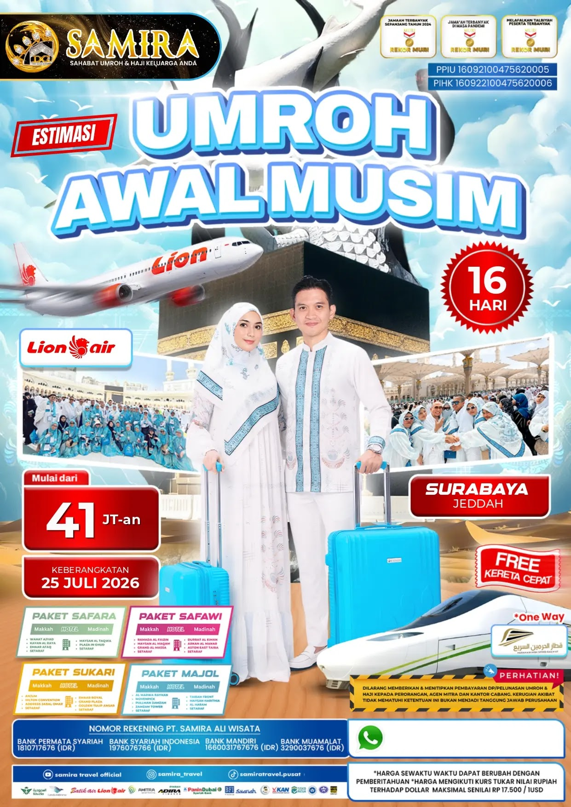
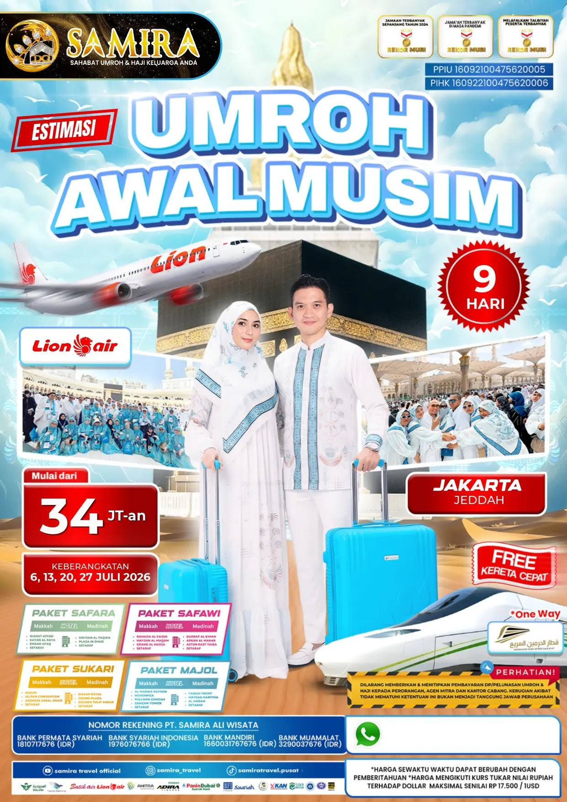
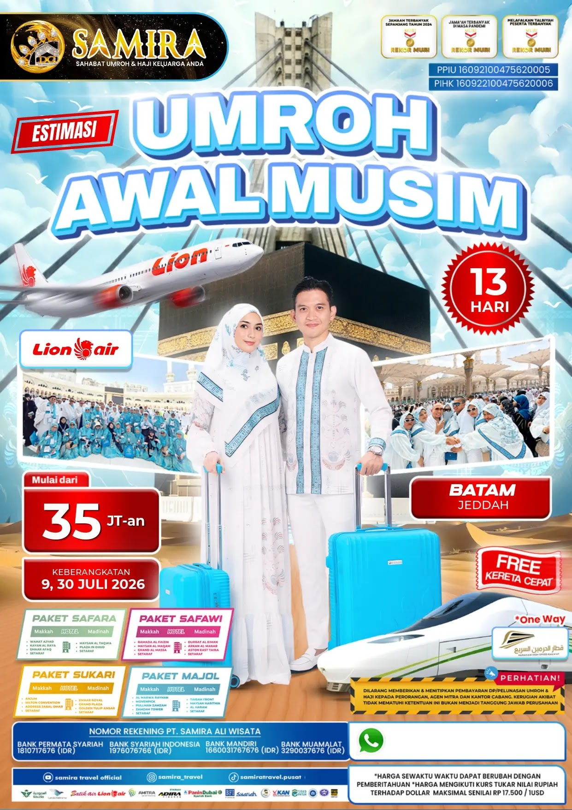
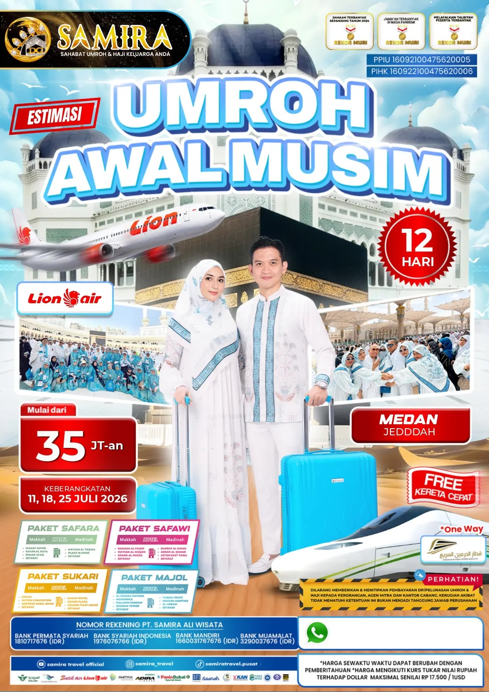
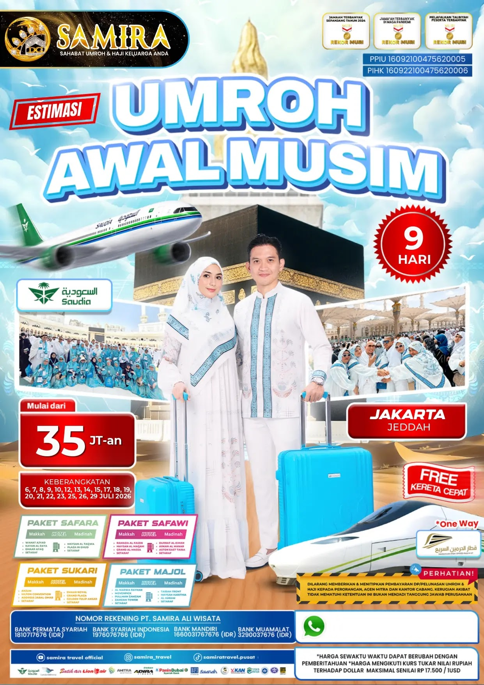
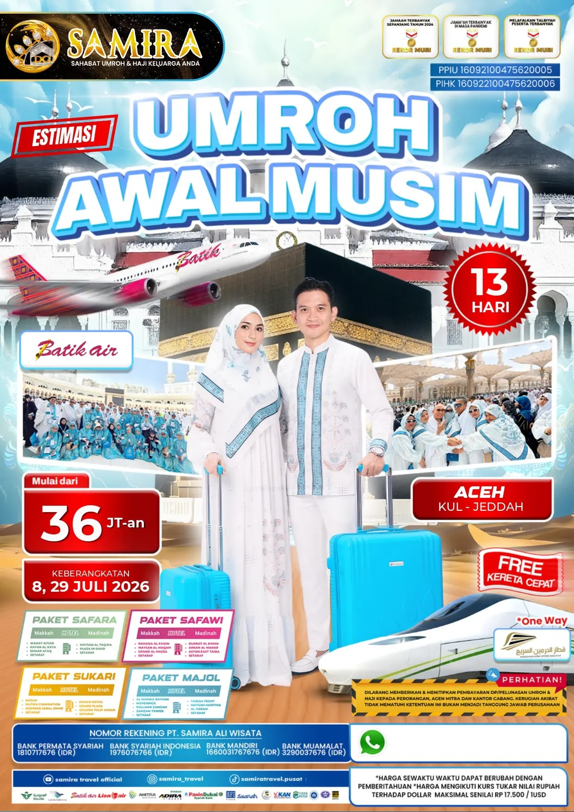
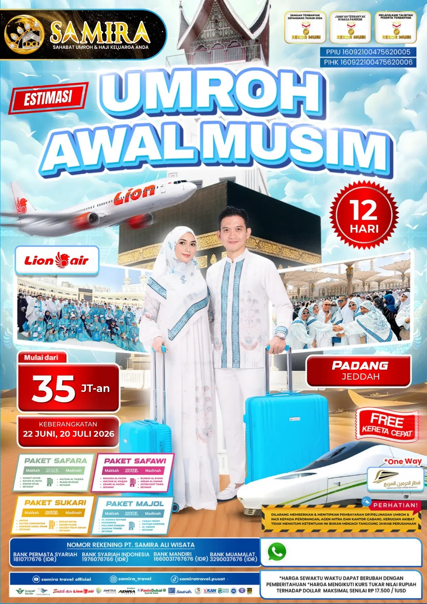
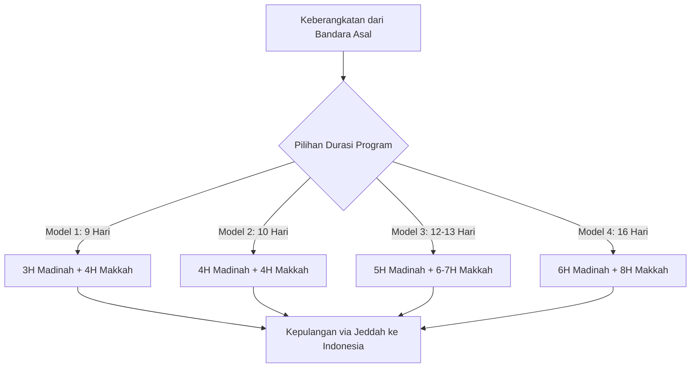

# Katalog Paket Umroh Reguler & Analisis Embarkasi Lengkap - Samira Travel

Dokumen ini menyajikan katalog resmi seluruh paket **Umroh Reguler Samira Travel (PT Samira Ali Wisata)**. Format dokumen telah disempurnakan secara modular guna menghilangkan duplikasi teks (*non-redundant*), membedakan secara spesifik karakteristik logistik setiap kota embarkasi, membedah 4 model durasi hari (9, 10, 12/13, dan 16 Hari), serta menyematkan brosur resmi beresolusi tinggi (**Ultra HD 1241 x 1755 px**).

---

## 1. Matriks Komparasi 11 Embarkasi Keberangkatan Nasional

Samira Travel melayani penerbangan langsung (*direct flight*) maupun terkoordinasi dari bandara-bandara internasional utama di Indonesia langsung menuju **Jeddah (Bandara King Abdulaziz)** atau **Madinah (Bandara Prince Mohammad bin Abdulaziz)**:

| No | Kota Embarkasi | Bandara Asal & Kode Rute | Durasi Pilihan | Maskapai & Armada | Tanggal Keberangkatan (Musim Baru) | Estimasi Harga Quad | Brosur Resmi HD |
|:---:|:---|:---|:---:|:---|:---|:---:|:---:|
| 1 | **Surabaya** | Bandara Internasional Juanda (SUB – JED) | **12, 13, 16 Hari** | Lion Air (Airbus A330-900NEO Direct) | 7, 14, 21, 25, 28 Juli 2026 | Mulai **Rp 38 Jt – 41 Jt-an** | `brosur-keberangkatan-10.webp` |
| 2 | **Jakarta** | Bandara Internasional Soekarno-Hatta (CGK – JED) | **9, 10, 12 Hari** | Lion Air / Saudia Airlines (Direct) | Multi-tanggal (6 s.d. 29 Juli 2026) | Mulai **Rp 35 Jt – 36 Jt-an** | `brosur-keberangkatan-02.webp` |
| 3 | **Medan** | Bandara Internasional Kualanamu (KNO – JED) | **12 Hari** | Lion Air (Direct Charter) | 11, 18, 25 Juli 2026 | Mulai **Rp 35 Jt-an** | `brosur-keberangkatan-05.webp` |
| 4 | **Batam** | Bandara Internasional Hang Nadim (BTH – JED) | **13 Hari** | Lion Air (Direct Charter) | 9 & 30 Juli 2026 | Mulai **Rp 35 Jt-an** | `brosur-keberangkatan-01.webp` |
| 5 | **Padang** | Bandara Internasional Minangkabau (PDG – JED) | **12 Hari** | Lion Air (Direct Charter) | 22 Juni & 20 Juli 2026 | Mulai **Rp 35 Jt-an** | `brosur-keberangkatan-06.webp` |
| 6 | **Pekanbaru** | Bandara Sultan Syarif Kasim II (PKU – JED) | **9 / 13 Hari** | Lion Air (Direct / Transit) | Awal Musim & Juli 2026 | Mulai **Rp 34 Jt – 35 Jt-an** | `brosur-keberangkatan-03.webp` |
| 7 | **Palembang** | Bandara Sultan Mahmud Badaruddin II (PLM – JED) | **9 / 10 Hari** | Lion Air (Direct Charter) | 19 Juli 2026 & Awal Musim | Mulai **Rp 35 Jt – 38 Jt-an** | `brosur-keberangkatan-04.webp` |
| 8 | **Aceh** | Bandara Sultan Iskandar Muda (BTJ – KUL – JED) | **13 Hari** | Lion Air / Batik Air via KUL | 8 & 29 Juli 2026 | Mulai **Rp 36 Jt-an** | `brosur-keberangkatan-11.webp` |
| 9 | **Pontianak** | Bandara Supadio (PNK – CGK – JED) | **13 Hari** | Lion Air (Koneksi Domestik + Direct) | Juli – Agustus 2026 | Mulai **Rp 39 Jt-an** | `brosur-keberangkatan-07.webp` |
| 10 | **Makassar** | Bandara Sultan Hasanuddin (UPG – JED) | **12 Hari** | Lion Air (Direct Charter Indonesia Timur) | Juli – Agustus 2026 | Mulai **Rp 35 Jt – 39 Jt-an** | `brosur-keberangkatan-09.webp` |
| 11 | **Denpasar** | Bandara Internasional I Gusti Ngurah Rai (DPS – JED)| **12 Hari** | Lion Air (Koneksi Bali & NTB) | Juli – Agustus 2026 | Mulai **Rp 35 Jt – 36 Jt-an** | `brosur-keberangkatan-08.webp` |

> *Catatan*: Seluruh paket mencakup tipe kamar **Safara Room Quad** (1 kamar berempat). Pilihan upgrade kamar **Triple (ber-3)** dan **Double (ber-2)** tersedia dengan biaya tambahan sesuai kurs hotel di Makkah & Madinah.

---

## 2. Profil Rinci Paket per Kota Embarkasi (11 Embarkasi)

Setiap embarkasi memiliki konfigurasi logistik penerbangan dan jadwal keberangkatan yang disesuaikan dengan kebutuhan jamaah di daerah:

### 2.1. Embarkasi Surabaya (Jawa Timur & Indonesia Timur)
- **Bandara Asal**: Bandara Internasional Juanda (SUB), Terminal 2 Internasional.
- **Rute Penerbangan**: Surabaya (SUB) – Jeddah (JED) Non-stop (*Direct Flight*).
- **Armada Maskapai**: Lion Air Airbus A330-900NEO berbadan lebar (*wide-body aircraft*).
- **Varian Durasi**:
  1. **Program 12 Hari**: Keberangkatan 25 Juli 2026 (Mulai Rp 38 Jt-an).
  2. **Program 13 Hari**: Keberangkatan 7, 14, 21, 28 Juli 2026 (Mulai Rp 39 Jt-an).
  3. **Program 16 Hari (Paket Ibadah Panjang)**: Keberangkatan 25 Juli 2026 (Mulai Rp 41 Jt-an).
- **Keunggulan**: Sangat diminati jamaah Jawa Timur, Madura, dan sekitarnya karena tidak perlu transit di Jakarta, bagasi terkoordinasi langsung, dan waktu tempuh lebih hemat energi.
- **Brosur Resmi HD**:
  
  

---

### 2.2. Embarkasi Jakarta (Jabodetabek, Banten & Jawa Barat)
- **Bandara Asal**: Bandara Internasional Soekarno-Hatta (CGK), Terminal 3 Internasional.
- **Rute Penerbangan**: Jakarta (CGK) – Jeddah (JED) / Madinah (MED) Non-stop.
- **Varian Durasi**:
  1. **Program 9 Hari**: Pilihan tanggal terbanyak (6, 7, 8, 9, 10, 12, 13, 14, 15, 17, 18, 19, 20, 21, 22, 23, 25, 26, 29 Juli 2026) — Mulai Rp 35 Jt-an.
  2. **Program 10 Hari**: Keberangkatan 19 Juli 2026 — Mulai Rp 35 Jt-an.
  3. **Program 12 Hari**: Keberangkatan 6, 10, 16, 20, 23, 27, 28, 29 Juli 2026 — Mulai Rp 36 Jt-an.
- **Keunggulan**: Frekuensi keberangkatan hampir setiap hari, fleksibilitas tanggal tertinggi, dan integrasi penjemputan handling terluas.
- **Brosur Resmi HD**:
  
  

---

### 2.3. Embarkasi Medan (Sumatera Utara & Sekitarnya)
- **Bandara Asal**: Bandara Internasional Kualanamu (KNO), Deli Serdang.
- **Rute Penerbangan**: Medan (KNO) – Jeddah (JED) Penerbangan Langsung.
- **Durasi Program**: 12 Hari.
- **Tanggal Keberangkatan**: 11, 18, dan 25 Juli 2026.
- **Harga Paket**: Mulai Rp 35 JT-an / pax.
- **Keunggulan**: Memangkas waktu tempuh jamaah Sumatera Utara dan sekitarnya tanpa harus terbang ke Jakarta terlebih dahulu.
- **Brosur Resmi HD**:
  
  

---

### 2.4. Embarkasi Batam (Kepulauan Riau)
- **Bandara Asal**: Bandara Internasional Hang Nadim (BTH), Batam.
- **Rute Penerbangan**: Batam (BTH) – Jeddah (JED) Langsung.
- **Durasi Program**: 13 Hari.
- **Tanggal Keberangkatan**: 9 dan 30 Juli 2026.
- **Harga Paket**: Mulai Rp 35 JT-an / pax.
- **Keunggulan**: Pusat konsolidasi jamaah kepulauan Riau (Tanjung Pinang, Karimun, Natuna) dengan fasilitas handling pelabuhan dan bandara terpadu.
- **Brosur Resmi HD**:
  
  

---

### 2.5. Embarkasi Padang (Sumatera Barat)
- **Bandara Asal**: Bandara Internasional Minangkabau (PDG), Ketaping, Padang Pariaman.
- **Rute Penerbangan**: Padang (PDG) – Jeddah (JED) Langsung.
- **Durasi Program**: 12 Hari.
- **Tanggal Keberangkatan**: 22 Juni dan 20 Juli 2026.
- **Harga Paket**: Mulai Rp 35 JT-an / pax.
- **Keunggulan**: Memudahkan jamaah Ranah Minang dengan penerbangan langsung, katering menu khas Minang selama perjalanan.
- **Brosur Resmi HD**:
  
  

---

### 2.6. Embarkasi Pekanbaru (Riau Daratan)
- **Bandara Asal**: Bandara Internasional Sultan Syarif Kasim II (PKU), Pekanbaru.
- **Rute Penerbangan**: Pekanbaru (PKU) – Jeddah (JED).
- **Durasi Program**: 9 & 13 Hari.
- **Harga Paket**: Mulai Rp 34 JT – 35 JT-an / pax.
- **Brosur Resmi HD**:
  
  

---

### 2.7. Embarkasi Palembang (Sumatera Selatan)
- **Bandara Asal**: Bandara Internasional Sultan Mahmud Badaruddin II (PLM), Palembang.
- **Rute Penerbangan**: Palembang (PLM) – Jeddah (JED).
- **Durasi Program**: 9 & 10 Hari (Keberangkatan 19 Juli 2026).
- **Harga Paket**: Mulai Rp 35 JT – 38 JT-an / pax.
- **Brosur Resmi HD**:
  
  

---

### 2.8. Embarkasi Aceh (Serambi Mekkah)
- **Bandara Asal**: Bandara Internasional Sultan Iskandar Muda (BTJ), Blang Bintang, Aceh Besar.
- **Rute Penerbangan**: Aceh (BTJ) – Kuala Lumpur (KUL) – Jeddah (JED).
- **Durasi Program**: 13 Hari.
- **Tanggal Keberangkatan**: 8 dan 29 Juli 2026.
- **Harga Paket**: Mulai Rp 36 JT-an / pax.
- **Brosur Resmi HD**:
  
  

---

### 2.9. Embarkasi Pontianak (Kalimantan Barat)
- **Bandara Asal**: Bandara Internasional Supadio (PNK), Kubu Raya, Pontianak.
- **Rute Penerbangan**: Pontianak (PNK) – Transit CGK – Jeddah (JED).
- **Durasi Program**: 13 Hari.
- **Harga Paket**: Mulai Rp 39 JT-an / pax.
- **Brosur Resmi HD**:
  
  

---

### 2.10. Embarkasi Makassar (Sulawesi Selatan & Indonesia Timur)
- **Bandara Asal**: Bandara Internasional Sultan Hasanuddin (UPG), Maros / Makassar.
- **Rute Penerbangan**: Makassar (UPG) – Jeddah (JED) Penerbangan Langsung.
- **Durasi Program**: 12 Hari.
- **Harga Paket**: Mulai Rp 35 JT – 39 JT-an / pax.
- **Brosur Resmi HD**:
  
  

---

### 2.11. Embarkasi Denpasar (Bali & Nusa Tenggara)
- **Bandara Asal**: Bandara Internasional I Gusti Ngurah Rai (DPS), Tuban, Badung, Bali.
- **Rute Penerbangan**: Denpasar (DPS) – Jeddah (JED).
- **Durasi Program**: 12 Hari.
- **Harga Paket**: Mulai Rp 35 JT – 36 JT-an / pax.
- **Brosur Resmi HD**:
  
  

---

## 3. Empat Model Alur Perjalanan (Master Itinerary Architecture)

Untuk menghindari pengulangan teks yang monoton (*anti-duplication*), alur perjalanan Samira Travel distandarisasi ke dalam **4 model program terstruktur** yang disesuaikan dengan durasi hari tiket penerbangan:

### Model 1: Program 9 Hari (Jakarta / Palembang / Pekanbaru)
*Fokus: Program ibadah efisien dan padat bagi profesional dan keluarga dengan waktu terbatas.*
- **Hari 1 (Keberangkatan & Kedatangan di Madinah)**: Berkumpul di bandara keberangkatan, penerbangan menuju Jeddah/Madinah, proses imigrasi dan handling bagasi, transfer bus AC menuju hotel Madinah, istirahat.
- **Hari 2 (Madinah - Ibadah & Ziarah Dalam)**: Shalat Subuh berjamaah di Masjid Nabawi, ziarah ke Makam Rasulullah SAW, Raudhah Asy-Syarifah (sesuai tasreh/izin aplikasi Nusuk), dan pemakaman Jannatul Baqi'.
- **Hari 3 (Madinah - Ziarah Luar Kota)**: Shalat sunnah di Masjid Quba (pahala setara 1x umroh), ziarah ke Jabal Uhud dan Makam Syuhada Uhud, melewati Masjid Qiblatain, dan wisata Kebun Kurma.
- **Hari 4 (Menuju Makkah & Umroh Pertama)**: Mandi ihram di hotel Madinah, check-out, perjalanan bus menuju Miqat Masjid Bir Ali untuk berniat ihram umroh. Tiba di Makkah, check-in hotel, makan malam, dan pelaksanaan rangkaian rukun umroh pertama (Thawaf 7 putaran, Sa'i Shafa-Marwah 7x, Tahallul) dengan panduan audio receiver (APS).
- **Hari 5 (Makkah - Ibadah Mandiri)**: Memperbanyak shalat fardhu, thawaf sunnah, tilawah Al-Qur'an, dan munajat di depan Ka'bah.
- **Hari 6 (Makkah - Ziarah Kota Makkah & Umroh Kedua)**: Mengunjungi Jabal Tsur, Padang Arafah (Jabal Rahmah), Muzdalifah, dan Mina. Bagi jamaah yang hendak mengambil umroh sunnah kedua, mengambil miqat di Ji'ranah.
- **Hari 7 (Makkah - Ibadah Intensif)**: Hari penuh ibadah di Masjidil Haram, evaluasi bimbingan ibadah bersama muthawwif.
- **Hari 8 (Thawaf Wada' & Menuju Bandara Jeddah)**: Pelaksanaan Thawaf Wada' (thawaf perpisahan), check-out hotel Makkah, perjalanan transfer bus menuju Bandara Internasional King Abdulaziz Jeddah, proses check-in penerbangan pulang.
- **Hari 9 (Tiba di Tanah Air)**: Penerbangan kembali ke bandara asal di Indonesia. Penyerahan air zamzam 5 liter dan kepulangan ke rumah masing-masing.

---

### Model 2: Program 10 Hari (Jakarta)
*Fokus: Penambahan 1 hari adaptasi di Madinah untuk kenyamanan ibadah lansia.*
- **Hari 1**: Keberangkatan dan ketibaan di Madinah.
- **Hari 2**: Ibadah harian di Masjid Nabawi dan ziarah Makam Rasulullah SAW & Baqi'.
- **Hari 3**: Ziarah Kota Madinah (Masjid Quba, Uhud, Kebun Kurma).
- **Hari 4**: Hari tenang di Madinah untuk munajat di Raudhah dan kajian fiqih umroh.
- **Hari 5**: Mengambil Miqat di Bir Ali dan perjalanan menuju Makkah untuk pelaksanaan Umroh Wajib.
- **Hari 6**: Istirahat fisik dan shalat fardhu berjamaah di Masjidil Haram.
- **Hari 7**: Ziarah Kota Makkah (Arafah, Muzdalifah, Mina) dan Miqat Umroh Sunnah Ji'ranah.
- **Hari 8**: Ibadah mandiri di Masjidil Haram dan ziarah situs sejarah sekitar Masjidil Haram.
- **Hari 9**: Thawaf Wada' dan transfer kepulangan via Bandara Jeddah.
- **Hari 10**: Tiba kembali di tanah air dengan selamat.

---

### Model 3: Program 12 & 13 Hari (Surabaya, Medan, Padang, Batam, Aceh, Pontianak, Makassar, Denpasar)
*Fokus: Program standar paling diminati masyarakat daerah dengan porsi ibadah longgar (5 hari Madinah + 6–7 hari Makkah).*
- **Hari 1 – 5 di Madinah Al-Munawwarah**:
  - Check-in hotel ring 1 Madinah.
  - Kesempatan shalat berjamaah 40 waktu (Arba'in) atau memperbanyak shalat sunnah di pelataran Nabawi.
  - Ziarah Raudhah Asy-Syarifah dengan pendampingan tim muthawwif khusus.
  - Eksplorasi sejarah perang Uhud, napak tilas Masjid Quba, Masjid Jum'ah, dan Masjid Ghamamah.
- **Hari 6 (Perpindahan Madinah ke Makkah)**:
  - Persiapan ihram dari hotel, berniat di Miqat Bir Ali (Dzulhulaifah).
  - Melintasi jalan tol antar-kota Madinah-Makkah dengan bus eksklusif ber-toilet.
  - Tiba di Makkah Al-Mukarramah, penyegaran di hotel, makan malam berenergi, dan pelaksanaan Umroh Pertama malam hari.
- **Hari 7 – 11 di Makkah Al-Mukarramah**:
  - Shalat wajib di depan Ka'bah (pahala 100.000 kali lipat).
  - Ziarah Napak Tilas Haji: Menelusuri Jabal Rahmah tempat pertemuan Adam-Hawa, area wukuf Arafah, jalur pejalan kaki Muzdalifah, dan kemah tenda Mina.
  - Kesempatan mengambil **Umroh Sunnah ke-2 dan ke-3** (Miqat Ji'ranah dan Miqat Tan'im/Masjid Aisyah).
  - City Tour Jeddah (Kawasan Bersejarah Al-Balad, Masjid Terapung Laut Merah, Corniche) sebelum ke bandara.
- **Hari 12 / 13 (Kepulangan ke Indonesia)**:
  - Thawaf Wada', pelepasan muthawwif, proses imigrasi Jeddah, dan penerbangan kembali ke bandara embarkasi masing-masing di Indonesia.

---

### Model 4: Program Akbar 16 Hari (Surabaya)
*Fokus: Program ibadah panjang (*long-stay spiritual retreat*) bagi jamaah yang ingin mengkhatamkan Al-Qur'an dan beritikaf mendalam di Masjidil Haram & Masjid Nabawi.*
- **Alokasi Waktu**: **6 Hari di Madinah** dan **8 Hari di Makkah**.
- **Keistimewaan**:
  - Jamaah memiliki tempo fisik yang sangat santai tanpa terburu-buru jadwal perpindahan.
  - Sangat ramah bagi lansia karena memiliki hari pemulihan stamina di sela-sela ziarah.
  - Kesempatan menuntaskan ibadah sunnah secara maksimal, mengikuti shalat Tahajjud berjamaah rutin, serta ziarah museum-museum wahyu di Makkah dan Madinah.

---

## 4. Fasilitas Termasuk, Belum Termasuk & Visual Perlengkapan

### A. Fasilitas Termasuk (Inclusions):
- **Tiket Penerbangan**: Tiket pesawat internasional pulang-pergi kelas ekonomi (Lion Air charter / maskapai full service).
- **Akomodasi Hotel**: Hotel berbintang di Madinah dan Makkah sesuai kelas paket (Safara Room Quad).
- **Konsumsi**: Makan dan minum 3 kali sehari (*Fullboard*) menu masakan nusantara.
- **Transportasi**: Bus pariwisata eksekutif AC dilengkapi toilet untuk rute transfer bandara, Madinah, Makkah, dan Miqat.
- **Pembimbing Ibadah**: Muthawwif berpengalaman berbahasa Indonesia dan Tour Leader bersertifikat BNSP.
- **Teknologi**: Perangkat nirkabel *Audio Receiver* / Audio Pemandu Shalat (APS) selama thawaf & sa'i.
- **Air Zamzam**: Galon 5 liter per jamaah (menyesuaikan regulasi penerbangan KSA).
- **Visa & Asuransi**: Visa Umroh resmi terdaftar SISKOPATUH dan asuransi perjalanan internasional.
- **Manasik**: Bimbingan manasik intensif sebelum keberangkatan di hotel daerah.

---

### B. Visualisasi Kit Perlengkapan Resmi Jamaah
Setiap jamaah mendapatkan 1 set lengkap perlengkapan ibadah berkualitas tinggi:

*Isi Kit Perlengkapan Umroh Samira Travel: Koper Bagasi Fiber Hardcase (Roda Putar 360°), Tas Paspor/Selempang, Kain Ihram Katun Premium (Pria), Mukena dan Bergo Panjang Syar'i (Wanita), Bahan Seragam Batik Resmi Samira, Sabuk Ihram, dan Buku Panduan Doa Manasik Lengkap.*

---

### C. Biaya Belum Termasuk (Exclusions):
1. Biaya pembuatan atau perpanjangan paspor di kantor imigrasi.
2. Biaya vaksinasi meningitis internasional di fasilitas kesehatan resmi.
3. **Biaya Handling Bandara & Perlengkapan Umroh sebesar Rp 1.500.000,-**.
4. Biaya tiket domestik dari kota asal menuju bandara embarkasi utama (bila memilih rute transit).
5. Biaya kelebihan bagasi (*excess baggage*) melebihi kapasitas standar maskapai.
6. Pengeluaran pribadi (laundry, room service, telepon roaming/data lokal, kursi roda berbayar).
7. Biaya regulasi atau retribusi baru yang diterbitkan sepihak oleh otoritas Kerajaan Arab Saudi.

---

## 5. Layanan Konsultasi & Pendaftaran Umroh Terpadu

Untuk konsultasi pemilihan kota keberangkatan, jadwal penerbangan, ketersediaan kursi pesawat, dan pendaftaran resmi:
- **Layanan Kontak Terpadu (Telepon & WhatsApp)**: **`0856-0717-9735`**
- **Tautan WhatsApp Langsung**: [https://wa.me/6285607179735](https://wa.me/6285607179735)
- **Email Resmi**: `samiratravelsurabayaterpercaya@gmail.com`
