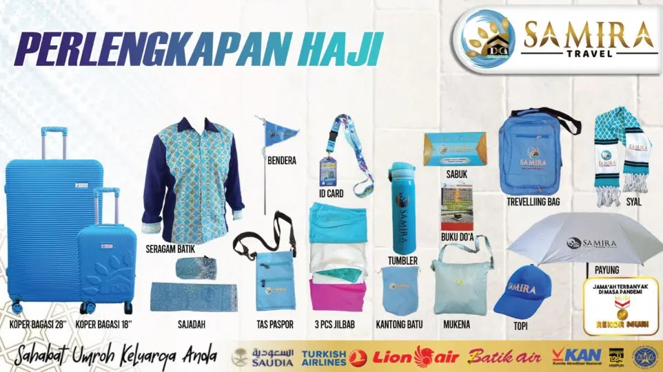

# Program Haji Khusus & Haji Furoda - Samira Travel

Dokumen ini memuat panduan lengkap mengenai program **Haji Khusus / Haji Furoda (Haji Mujamalah)** yang diselenggarakan oleh Samira Travel (PT Samira Ali Wisata) sebagai Penyelenggara Ibadah Haji Khusus (PIHK) resmi yang berizin Kementerian Agama Republik Indonesia.

---

## 1. Ringkasan Program Haji Khusus Furoda

Program Haji Furoda adalah solusi perjalanan ibadah haji langsung berangkat tanpa harus menunggu antrean puluhan tahun (haji tanpa antri), menggunakan kuota resmi Visa Haji Mujamalah yang diterbitkan langsung oleh Pemerintah Kerajaan Arab Saudi.

| Komponen | Rincian Program |
|:---|:---|
| **Nama Program** | Haji Khusus / Haji Furoda (Tanpa Antri) |
| **Estimasi Biaya** | **USD 17.000** (Dolar Amerika Serikat) |
| **Uang Muka (DP)** | **USD 5.000** (*Full Refund 100%* jika Visa Haji tidak terbit) |
| **Durasi Program** | **20 Hari** |
| **Waktu Keberangkatan** | **Kloter Akhir Musim Haji** (menjelang puncak wukuf di Arafah) |
| **Legalitas Penyelenggara** | Izin Resmi PIHK Kementerian Agama RI (PT Samira Ali Wisata) |
| **Kontak Khusus Haji** | `0856-0717-9735` (Telepon & WhatsApp) |

---

## 2. Fasilitas & Layanan Program Haji Khusus

### A. Fasilitas Termasuk (Inclusions):
1. **Tiket Penerbangan**:
   - Tiket pesawat internasional kelas ekonomi pulang-pergi (Jakarta – Saudi Arabia PP).
2. **Akomodasi Hotel & Tenda**:
   - Hotel berbintang di Makkah dan Madinah sesuai program.
   - Layanan makanan dan minuman 3 kali sehari (*Fullboard Hotel*) dengan cita rasa nusantara.
   - Fasilitas tenda ber-AC di Arafah dan Mina khusus maktab haji khusus.
3. **Transportasi di Arab Saudi**:
   - Armada Bus Eksklusif berpendingin udara (AC) dilengkapi fasilitas Toilet di dalam bus untuk perjalanan transfer bandara, ziarah, rute Makkah-Madinah, dan perpindahan masya'ir (Arafah-Muzdalifah-Mina).
4. **Bimbingan & Pendampingan Profesional**:
   - Muthawwif (pembimbing ibadah haji) berpengalaman dan fasih berbahasa Indonesia.
   - Tour Leader resmi bersertifikat **BNSP (Badan Nasional Sertifikasi Profesi)** yang mengawal sejak keberangkatan dari Jakarta hingga tiba kembali di Indonesia.
5. **Logistik & Konsumsi Tambahan**:
   - *Welcome Food* pada saat keberangkatan dan kepulangan.
   - Snack box segar pada setiap rute perjalanan ziarah di Makkah dan Madinah.
   - Air Zamzam 5 Liter (disesuaikan dengan regulasi otoritas penerbangan Saudi Arabia).
6. **Administrasi & Asuransi**:
   - Penerbitan Visa Haji Khusus / Furoda resmi terdaftar di sistem e-Hajj KSA.
   - Jatah bagasi maskapai: 2 koli (23 kg x 2 = total 46 kg).
   - Asuransi perjalanan dan perlindungan kesehatan internasional.
   - Program Bimbingan Manasik Haji intensif (teori, fikih haji, dan simulasi lapangan) di hotel berbintang sebelum keberangkatan.

---

### B. Biaya Belum Termasuk (Exclusions):
1. Biaya pembuatan dan perpanjangan paspor di kantor imigrasi.
2. Biaya vaksinasi meningitis internasional dan buku kuning (*International Certificate of Vaccination*).
3. **Biaya Handling Bandara & Perlengkapan Haji**: Sebesar **Rp 1.500.000** (koper fiber ukuran besar, tas dokumen, seragam batik Samira, kain ihram / mukena, sabuk haji, buku manasik & doa haji).

### C. Visualisasi Perlengkapan Haji Khusus

*Fasilitas Perlengkapan Resmi Jamaah Haji Samira Travel: Koper Bagasi, Koper Kabin, Tas Paspor, Seragam Batik, Ihram/Mukena, Sabuk Haji, Buku Doa, dan Kartu Identitas.*
4. Biaya hotel transit domestik (jika diperlukan oleh jamaah luar pulau).
5. Tiket pesawat atau biaya transportasi domestik dari daerah asal menuju Jakarta PP.
6. Biaya kelebihan bagasi (*excess baggage*) di luar alokasi maskapai.
7. Biaya dam (denda haji tamattu) atau qurban pribadi di tanah suci.
8. Pengeluaran pribadi (laundry, room service hotel, telepon roaming, kursi roda berbayar).
9. Biaya tambahan tidak terduga apabila terdapat retribusi atau regulasi baru dari Kerajaan Arab Saudi.

---

## 3. Syarat & Tata Cara Pendaftaran Haji Khusus

### Persyaratan Administrasi:
- **Paspor**: Berlaku aktif minimal 8 bulan sebelum jadwal keberangkatan, dengan nama tercantum minimal 2 suku kata.
- **Kependudukan**: Fotokopi e-KTP dan Kartu Keluarga (KK).
- **Pas Foto**: Berwarna latar belakang putih, rasio wajah 80%, tidak mengenakan kacamata, wanita tidak mengenakan jilbab putih. Ukuran 3x4 = 2 lembar dan file softcopy resolusi tinggi.
- **Salinan Akta Lahir / Buku Nikah / Ijazah**: Untuk pencocokan data identitas paspor dan e-Hajj.

### Ketentuan Pembayaran:
1. **Uang Muka (DP)**: Sebesar **USD 5.000** disetorkan saat pendaftaran.
   - **Jaminan Keamanan Dana**: Jika Visa Haji Furoda tidak disetujui / tidak terbit oleh otoritas Kerajaan Arab Saudi, uang DP dikembalikan **100% utuh tanpa potongan** (*Non-loss guarantee*).
2. **Pelunasan Biaya**: Seluruh berkas administrasi dan pelunasan sisa biaya diselesaikan paling lambat **10 hari** sebelum tanggal keberangkatan kloter haji.
3. **Penyetoran Resmi**: Pembayaran wajib disetorkan langsung ke rekening resmi valas **PT Samira Ali Wisata** di Bank Permata Syariah (USD) atau Bank Mandiri (USD).

---

## 4. Rangkaian Manasik & Pelaksanaan Ibadah Haji

Samira Travel menyelenggarakan bimbingan ibadah haji komprehensif yang mengedepankan ketenangan, kenyamanan, dan keabsahan syariat:
- **Pelaksanaan Haji Tamattu'**: Melaksanakan umroh wajib terlebih dahulu di bulan-bulan haji, kemudian bertahallul, dan berniat ihram haji pada tanggal 8 Dzulhijjah (Hari Tarwiyah).
- **Pemberangkatan Kloter Akhir**: Mempersingkat waktu tunggu di Arab Saudi sehingga kondisi fisik jamaah tetap prima saat memasuki hari-hari puncak masya'ir.
- **Wukuf di Arafah (9 Dzulhijjah)**: Rukun haji terpenting yang diisi dengan khotbah wukuf, dzikir bersama, muhasabah, dan doa mustajab.
- **Mabid di Muzdalifah & Mina (10-13 Dzulhijjah)**: Pengambilan kerikil, melempar jumrah (Ula, Wustha, Aqabah), dan tahallul awal serta akhir dengan pendampingan ketat tim muthawwif.
- **Thawaf Ifadhah & Sa'i Haji**: Pelaksanaan rukun haji di Masjidil Haram dengan pengaturan waktu terbaik guna menghindari penumpukan massa.
- **Layanan Badal Haji**: Bagi keluarga yang hendak membadalkan haji orang tua atau kerabat yang telah wafat atau menderita sakit menahun/udzur syar'i permanen, Samira Travel menyediakan layanan amanah badal haji yang dibimbing langsung oleh muthawwif di tanah suci disertai sertifikat resmi.

---

## 5. Layanan Konsultasi Haji Khusus Furoda

Untuk konsultasi kuota visa haji mujamalah, alokasi maktab, dan pendaftaran haji tanpa antri:
- **Layanan Kontak Terpadu (Telepon & WhatsApp)**: **`0856-0717-9735`**
- **Email Resmi**: `samiratravelsurabayaterpercaya@gmail.com`
