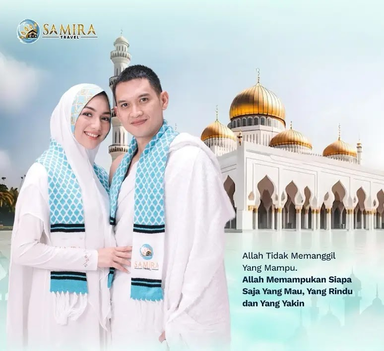

# Media, Video Dokumentasi & Galeri Brosur HD - Samira Travel

Dokumen ini menghimpun seluruh aset media multimedia resmi dari portal **Samira Travel (PT Samira Ali Wisata)** serta kanal representatif `https://www.travelsamira.web.id/`. Berkas mencakup tautan dan metadata 8 video resmi produksi **Samira Travel Official**, galeri 11 brosur keberangkatan berkualitas tinggi (**Resolusi Ultra HD: 1241 x 1755 piksel**), serta visualisasi kit perlengkapan haji dan umroh.

---

## 1. Direktori Video Dokumentasi Resmi (Samira Travel Official)

Seluruh video berikut merupakan produksi resmi yang mendokumentasikan pemecahan rekor dunia, rekor MURI, perayaan milad akbar, serta testimoni haru jamaah khusus:

| No | Judul Video Resmi | Durasi / Topik Utama | Tautan Nonton (Watch URL) | Kode Semat (Embed URL) |
|:---:|:---|:---|:---:|:---:|
| 1 | **SAMIRA Rekor Muri ke 3 (Jamaah Terbanyak Tahun 2024)** | Penganugerahan Rekor MURI ke-3 atas pencapaian 29.171 jamaah sepanjang 2024 | [Tonton di YouTube](https://www.youtube.com/watch?v=JzBT0sK_lsQ) | `https://www.youtube.com/embed/JzBT0sK_lsQ` |
| 2 | **KILAS BALIK 2026 - MILAD SAMIRA Ke 10** | Dokumentasi perjalanan 10 tahun (Satu Dekade) Samira Travel di ICE BSD City | [Tonton di YouTube](https://www.youtube.com/watch?v=C-cTXHf85cs) | `https://www.youtube.com/embed/C-cTXHf85cs` |
| 3 | **MILAD SAMIRA KE 9 - JEDDAH SAFARI DESERT** | Dokumentasi pemecahan **Guinness World Records** makan malam halal 10.449 jamaah di Asfan, Jeddah | [Tonton di YouTube](https://www.youtube.com/watch?v=3Tw7sb6mAVs) | `https://www.youtube.com/embed/3Tw7sb6mAVs` |
| 4 | **JABAL UHUD DIPENUHI OLEH RIBUAN JAMAAH UMROH SAMIRA TRAVEL** | Ziarah akbar ribuan jamaah berseragam Samira Travel di pelataran Jabal Uhud, Madinah | [Tonton di YouTube](https://www.youtube.com/watch?v=c1pNTsfJQOg) | `https://www.youtube.com/embed/c1pNTsfJQOg` |
| 5 | **Kilas Balik Milad 8 Full Samira Mendunia** | Rangkuman milad ke-8 dan konsolidasi akbar mitra Pejuang Baitullah | [Tonton di YouTube](https://www.youtube.com/watch?v=BqNlXF_dOhE) | `https://www.youtube.com/embed/BqNlXF_dOhE` |
| 6 | **Lagu SAMIRA MENDUNIA** | Lagu tema (Official Anthem / Jingle) kebesaran syiar baitullah Samira Travel | [Tonton di YouTube](https://www.youtube.com/watch?v=NOMhHxUgzeQ) | `https://www.youtube.com/embed/NOMhHxUgzeQ` |
| 7 | **Testimoni Pasien Cuci Darah Samira Travel** | Pengalaman langsung pelayanan medis dan pendampingan jamaah hemodialisa selama di Tanah Suci | [Tonton di YouTube](https://www.youtube.com/watch?v=IiinsNvVXDo) | `https://www.youtube.com/embed/IiinsNvVXDo` |
| 8 | **1,576 JAMAAH SAMIRA TRAVEL ZIARAH DI JABAL UHUD** | Liputan program ziarah massal 1.576 jamaah serentak di kota suci Madinah | [Tonton di YouTube](https://www.youtube.com/watch?v=ZLcqJKDffGA) | `https://www.youtube.com/embed/ZLcqJKDffGA` |

---

## 2. Galeri Brosur Paket Umroh Resolusi Tinggi (Ultra HD: 1241 x 1755 px)

Brosur-brosur ini memiliki resolusi cetak A4 berstandar tinggi yang memuat rute, durasi hari, tanggal keberangkatan, dan estimasi harga per kota:

| No | Rute / Embarkasi | Durasi | Tanggal Keberangkatan | Harga Paket | Berkas Lokal HD |
|:---:|:---|:---:|:---|:---:|:---|
| 1 | **Batam – Jeddah** | 13 Hari | 9 & 30 Juli 2026 | Mulai 35 JT-an | `assets/images/brosur-keberangkatan-01.webp` |
| 2 | **Jakarta – Jeddah** | 9 Hari | 6, 7, 8, 9, 10, 12, 13, 14, 15, 17, 18, 19, 20, 21, 22, 23, 25, 26, 29 Juli 2026 | Mulai 35 JT-an | `assets/images/brosur-keberangkatan-02.webp` |
| 3 | **Pekanbaru – Jeddah** | 9 Hari | Periode Awal Musim | Mulai 34 JT-an | `assets/images/brosur-keberangkatan-03.webp` |
| 4 | **Palembang – Jeddah** | 10 Hari | 19 Juli 2026 | Mulai 35 JT-an | `assets/images/brosur-keberangkatan-04.webp` |
| 5 | **Medan – Jeddah** | 12 Hari | 11, 18, 25 Juli 2026 | Mulai 35 JT-an | `assets/images/brosur-keberangkatan-05.webp` |
| 6 | **Padang – Jeddah** | 12 Hari | 22 Juni & 20 Juli 2026 | Mulai 35 JT-an | `assets/images/brosur-keberangkatan-06.webp` |
| 7 | **Jakarta – Jeddah** | 12 Hari | 6, 10, 16, 20, 23, 27, 28, 29 Juli 2026 | Mulai 36 JT-an | `assets/images/brosur-keberangkatan-07.webp` |
| 8 | **Surabaya – Jeddah** | 16 Hari | 25 Juli 2026 | Mulai 41 JT-an | `assets/images/brosur-keberangkatan-08.webp` |
| 9 | **Surabaya – Jeddah** | 13 Hari | 7, 14, 21, 28 Juli 2026 | Mulai 39 JT-an | `assets/images/brosur-keberangkatan-09.webp` |
| 10 | **Surabaya – Jeddah** | 12 Hari | 25 Juli 2026 | Mulai 38 JT-an | `assets/images/brosur-keberangkatan-10.webp` |
| 11 | **Aceh – KUL – Jeddah** | 13 Hari | 8 & 29 Juli 2026 | Mulai 36 JT-an | `assets/images/brosur-keberangkatan-11.webp` |

---

## 3. Visualisasi Perlengkapan Resmi Haji & Umroh

### A. Kit Perlengkapan Umroh Samira Travel

- **Komponen**: Koper bagasi fiber hardcase roda ganda 360°, tas selempang paspor & dokumen, mukena dan bergo panjang syar'i (wanita), 2 lembar kain ihram katun premium (pria), seragam batik khas Samira Travel, sabuk ihram, dan buku saku doa manasik.

### B. Kit Perlengkapan Haji Khusus Samira Travel

- **Komponen**: Koper besar bagasi 28 inci, koper kabin 20 inci, tas paspor gantung, tas ransel lipat, pakaian ihram/mukena haji, syal/seragam batik resmi, sabuk pengaman ihram, buku bimbingan manasik haji bersanad, dan kartu identitas maktab haji khusus.

---

## 4. Materi Motivasi & Syiar Baitullah

> *"Allah tidak memanggil yang mampu. Allah memampukan siapa saja yang mau, yang rindu, dan yang yakin."*
