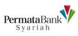
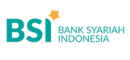
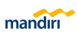
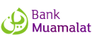
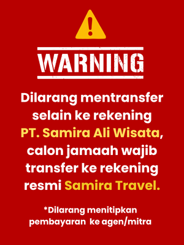

# Analisis Komprehensif & Dokumentasi Konten Website Samira Travel (samiratravel.co.id)

Repositori ini memuat dokumentasi lengkap hasil analisis mendalam, penjelajahan menyeluruh per halaman (*page-by-page content scraping*), serta validasi silang (*cross-referencing*) independen terhadap portal resmi **Samira Travel (PT Samira Ali Wisata)** — `https://www.samiratravel.co.id/`.

Data yang dihimpun mencakup seluruh struktur produk paket umroh & haji, harga, *itinerary* rinci, skema pembiayaan syariah, profil badan hukum, legalitas Kemenag RI, akreditasi, jejaring 26 cabang, ekosistem kemitraan DGi, rekor dunia *Guinness World Records*, 3 Rekor MURI, ulasan testimoni, serta direktori **400 artikel** edukasi.

---

## 1. Ringkasan Eksekutif & Kredensial Resmi Entitas

| Parameter Entitas | Keterangan Profil & Legalitas Resmi |
|:---|:---|
| **Nama Badan Hukum** | **PT Samira Ali Wisata** |
| **Merek Dagang Resmi** | **Samira Travel** |
| **Slogan / Tagline** | *"Biro Perjalanan Umrah & Haji Khusus Resmi Kemenag RI"* |
| **Nomor Induk Berusaha (NIB)** | **`1609210047562`** (Sistem OSS Berbasis Risiko BKPM RI) |
| **Izin Operasional PPIU (Umroh)** | **SK Menteri Agama RI No. 137 Tahun 2020** *(Pembaruan dari SK Dirjen PHU No. D/834 Th 2016)* |
| **Izin Operasional PIHK (Haji)** | **SK Menteri Agama RI No. `16092100475620002`** *(Diterbitkan 25 Februari 2022)* |
| **Peringkat Akreditasi** | **Akreditasi A (Unggul / Sangat Baik)** standar PMA No. 8/2018 Kemenag RI |
| **Integrasi SISKOPATUH** | Terhubung penuh dengan Ditjen PHU Kemenag RI (Penerbitan NPU Resmi) |
| **Peringkat Volume Nasional** | **Peringkat #1 Nasional PPIU Sepanjang 2024** (28.673 – 29.171 jemaah via Siskopatuh Kemenag) |
| **Asosiasi Resmi** | Anggota **HIMPUH** (`H.102-01 Th 2020`) & **ASITA** (`NIA 1259/VIII/DPP/07`) |
| **Rekor Dunia** | **Guinness World Records** Ref ID **`15-782573`** (*10.449 peserta Halal Dinner di Jeddah*) |
| **Rekor Nasional** | **3x Rekor MURI** (Pandemi Covid 8.176 jemaah, Talbiyah 5.600 peserta, Jemaah Terbanyak 2024) |
| **Penghargaan Terbaru** | **APSI 2026** oleh tvOne (*Kategori Kinerja Operasional - Jemaah Terbanyak*, 5 Sept 2026) |
| **Kantor Pusat** | Jl. Malaka Merah No.7/6, Pondok Kopi, Duren Sawit, Jakarta Timur 13460 |
| **Pendiri & Pimpinan** | **H. Fauzi Wahyu Muntoro, S.E.** (Direktur Utama / CEO) & **Hj. drg. Dini Lukitasari** (Komisaris Utama) |
| **Brand Ambassador** | **Ungu Band** (Milad 1 Dekade), **Citra Kirana & Rezky Adhitya** (Program UMBAST) |

---

## 2. Struktur Dokumen & Indeks File Markdown

Dokumentasi repositori ini disusun secara tematis ke dalam file-file spesifik sebagai berikut:

```text
samiratravelumroh/
├── README.md                                # Master Briefing, Profil Legal, Analisis Pasar & Indeks
├── 01_PROFIL_PERUSAHAAN_DAN_PENGHARGAAN.md  # Legalitas SK Kemenag, Sejarah DGi, Biodata Founder, Rekor & Rekening
├── 02_PAKET_UMROH_REGULER_DAN_HARGA.md      # 11 Paket Umroh Reguler, Harga Quad 11 Kota, Itinerary Lengkap & Syarat
├── 03_PAKET_UMROH_PLUS.md                   # 5 Paket Umroh Plus: Thaif, Riyadh, Jeddah, Al-Ula, Turkey
├── 04_HAJI_KHUSUS_DAN_FURODA.md             # Program Haji Furoda USD 17.000, 20 Hari, Maktab AC, DP Full Refund
├── 05_JARINGAN_KANTOR_CABANG_DAN_KONTAK.md  # Direktori Kantor Pusat & 26 Kantor Cabang Resmi se-Indonesia
├── 06_KEBIJAKAN_SYARAT_DAN_KEMITRAAN.md     # Alur Pelunasan, Refund, Pembiayaan Syariah Amitra/BSI & Model Kemitraan DGi
├── 07_TESTIMONI_JAMAAH.md                   # Ulasan Jamaah, Program Artis UMBAST, Pasien Hemodialisa & Rating Google
├── 08_KATALOG_ARTIKEL_DAN_EDUKASI.md        # Rangkuman 6 Pilar Edukasi & Direktori 400 Artikel Lengkap
├── 09_ASET_VISUAL_DAN_BUKTI_PENGHARGAAN.md  # Bukti Rekor Dunia, MURI, Rekening Resmi & Badge Homepage
├── 10_MEDIA_DAN_DOKUMENTASI_VIDEO.md        # Video Dokumentasi Resmi, Galeri Brosur HD (1241x1755px) & Fasilitas
└── ARTIKEL_PANDUAN_UTAMA_SEO.md             # 10 Artikel Pilar Edukasi SEO-Ready (Standar Copywriting & Content Skill)
```

---

## 3. Rangkuman Penawaran Produk & Struktur Biaya

### A. Paket Umroh Reguler (Safara Quad Room - Maskapai Lion Air):
1. **Jakarta** (9 Hari) — **Rp 36.000.000**
2. **Surabaya** (12 Hari) — **Rp 38.000.000**
3. **Medan** (12 Hari) — **Rp 36.000.000**
4. **Makassar** (12 Hari) — **Rp 35.000.000**
5. **Palembang** (9 Hari) — **Rp 38.000.000**
6. **Padang** (13 Hari) — **Rp 36.000.000**
7. **Pontianak** (13 Hari) — **Rp 39.000.000**
8. **Aceh** (13 Hari) — **Rp 35.000.000**
9. **Denpasar** (12 Hari) — **Rp 35.000.000**
10. **Batam** (13 Hari) — **Rp 39.000.000**
11. **Pekanbaru** (13 Hari) — **Rp 35.000.000**

### B. Paket Umroh Plus:
- **Umroh Plus Jeddah** (9 Hari) — Mulai dari **Rp 28.000.000-an**
- **Umroh Plus Ta'if (Thaif)** (9 Hari) — Mulai dari **Rp 29.000.000-an**
- **Umroh Plus Riyadh** (9 Hari) — Mulai dari **Rp 30.000.000-an**
- **Umroh Plus Al-Ula** (12 Hari) — Mulai dari **Rp 34.000.000-an**
- **Umroh Plus Turkey** (14 Hari) — Mulai dari **Rp 37.000.000-an**

### C. Program Haji Khusus Furoda (Tanpa Antri):
- **Biaya Paket**: **USD 17.000** (Dolar AS)
- **Uang Muka (DP)**: **USD 5.000** (*Garansi 100% Full Refund jika visa tidak disetujui*)
- **Durasi Program**: 20 Hari (Kloter Akhir Musim Haji)
- **Fasilitas Utama**: Tenda Maktab Haji Khusus ber-AC di Arafah & Mina, Bus pariwisata AC + Toilet, Hotel fullboard 3x makan menu nusantara, Pembimbing Muthawwif & Tour Leader bersertifikasi BNSP.

---

## 4. Keunggulan Kompetitif & Analisis Model Bisnis

1. **Skala Bisnis & Skema Penerbangan Langsung (Charter Flight)**:
   Sebagai biro umroh dengan volume terbesar di Indonesia (Peringkat 1 Siskopatuh Kemenag), Samira Travel melakukan kontrak sewa pesawat (*charter full-flight*) Lion Group dan Saudia. Hal ini memberikan jaminan **Pasti Berangkat** tanpa risiko penundaan sepihak.
2. **Ekosistem Kemitraan Agensi DGi (Pejuang Baitullah)**:
   Model kemitraan berjenjang (Mitra Lepas, Perwakilan, Cabang Resmi) yang non-MLM. Memberikan bagi hasil *fee* yang sehat (Rp 1,5 Jt - Rp 4 Jt/pax) serta sistem portal digital terintegrasi (`agen.samiratravel.co.id`).
3. **Fasilitasi Finansial Syariah (Umroh Dulu Bayar Belakangan)**:
   Kemitraan strategis dengan **AMITRA FIFGROUP (Astra Financial)**, **BSI**, dan **Permata Syariah** dengan akad syariah Ijarah Multijasa / Murabahah tanpa jaminan fisik (tenor 12-36 bulan).
4. **Teknologi Audio Receiver (APS) & SOP Medis Khusus**:
   Penggunaan earphone nirkabel pemandu thawaf/sa'i serta kesiapan pendampingan jamaah medis berkebutuhan khusus (termasuk jadwal tindakan cuci darah / hemodialisa di Makkah & Madinah).

---

## 5. Saluran Pembayaran Resmi (Anti-Penipuan)

Semua transaksi pembayaran wajib ditujukan langsung ke rekening resmi atas nama badan hukum **PT SAMIRA ALI WISATA**:

| Bank | Bukti Rekening | No. Rekening | Mata Uang | Atas Nama |
|:---|:---:|:---|:---:|:---|
| **Bank Permata Syariah** |  | `1810717676` (IDR) / `1810827676` (USD) | IDR / USD | PT Samira Ali Wisata |
| **Bank Syariah Indonesia (BSI)** |  | `1976076766` | IDR | PT Samira Ali Wisata |
| **Bank Mandiri** |  | `1660031767676` (IDR) / `1660064767676` (USD) | IDR / USD | PT Samira Ali Wisata |
| **Bank Muamalat** |  | `3290037676` | IDR | PT Samira Ali Wisata |

### Peringatan Keamanan Transaksi



> **PERHATIAN**: Samira Travel tidak pernah meminta transfer ke rekening pribadi perorangan (karyawan, muthawwif, agen). Pembayaran hanya sah via rekening resmi **PT SAMIRA ALI WISATA** atau Virtual Account resmi.
---

## 6. Kontak Layanan Resmi Samira Travel

- **Layanan Kontak Terpadu (Telepon & WhatsApp)**: **`0856-0717-9735`**
- **Tautan WhatsApp Langsung**: [https://wa.me/6285607179735](https://wa.me/6285607179735)
- **Cakupan Layanan**: Konsultasi Umroh Reguler, Umroh Plus, Haji Khusus Furoda, & Kemitraan Agensi DGi
- **Email Resmi**: `samiratravelsurabayaterpercaya@gmail.com`
