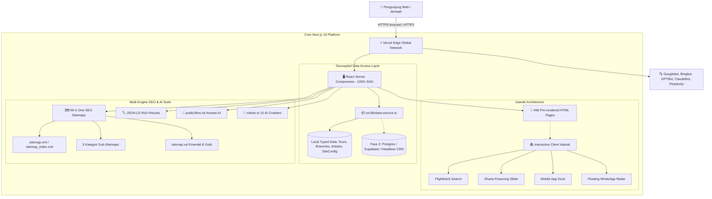

<div align="center">


# 🕋 Samira Travel
### *The Next-Generation Digital Sanctuary for Umroh & Haji Khusus*

**Penyelenggara Perjalanan Ibadah Umrah (PPIU No. 137/2020) & PIHK (No. 91201086915840001) Resmi Kemenag RI**  
*Peringkat #1 Nasional Volume Jemaah Terbanyak • Pemegang Guinness World Records & 3x Rekor MURI*

<br/>

[](https://samiratravelumrohhaji.com)
[-000000?style=for-the-badge&logo=next.js&logoColor=white)](https://nextjs.org)
[](https://www.typescriptlang.org/)
[-38B2AC?style=for-the-badge&logo=tailwind-css&logoColor=white)](https://tailwindcss.com)
[](https://samiratravelumrohhaji.com/sitemap.xml)
[-10B981?style=for-the-badge&logo=turborepo&logoColor=white)](https://github.com/ongkipro/samiratravelumroh)
[](https://samiratravelumrohhaji.com/sitemap_index.xml)
[](https://samiratravelumrohhaji.com/llms.txt)

<br/>

[**🌐 Live Portal**](https://samiratravelumrohhaji.com) • [**⚡ Edge CDN Mirror**](https://samiratravelumroh.vercel.app) • [**🏷️ Release v1.0.0**](https://github.com/ongkipro/samiratravelumroh/releases/tag/v1.0.0) • [**🗺️ XML Sitemap**](https://samiratravelumrohhaji.com/sitemap.xml) • [**🤖 LLM Grounding (llms.txt)**](https://samiratravelumrohhaji.com/llms.txt) • [**💬 WhatsApp Hotline**](https://wa.me/6285607179735)

<br/>

| 🕋 **#1 PPIU Kemenag** | 🏆 **Guinness & MURI** | ⚡ **12.9s Fast Build** | 🗺️ **466 SSG Routes** | 🤖 **AI-Ready Engine** |
| :---: | :---: | :---: | :---: | :---: |
| Volume Terbesar Nasional | 1 Rekor Dunia + 3 MURI | Turbopack 16.3 Engine | 100% Pre-rendered HTML | AIOSEO + 15 AI Crawlers |

</div>

---

## 🌟 Highlights & Key Advantages

**Samira Travel (PT Samira Ali Wisata)** menghadirkan terobosan infrastruktur digital bagi ekosistem perjalanan ibadah di tanah suci. Dibangun tanpa kompromi performa (*zero legacy baggage*), platform ini menggabungkan arsitektur *Static Site Generation* skala besar dengan desain ergonomis yang ramah lanjut usia.

```
┌────────────────────────────────────────────────────────────────────────────────────────┐
│                                                                                        │
│   🛩️  11 EMBARKASI CHARTER FLIGHT   Direct flight Lion Air & Saudia tanpa transit      │
│   🕋  HAJI KHUSUS FURODA 2026       USD 17.000 (Tanpa antre, garansi DP 100% Refund)   │
│   💳  PEMBIAYAAN SYARIAH AMITRA/BSI  Program "Umroh Dulu Bayar Belakangan" tanpa agunan │
│   🏢  26 KANTOR CABANG FISIK        Jejaring representatif lokal se-Indonesia          │
│   📚  400 ARTIKEL TOPICAL SILO      Pusat edukasi manasik & fiqih ibadah tanah suci    │
│   📱  MOBILE WEB APP DOCK           Ergonomi ramah lansia & 1-klik WhatsApp Concierge  │
│   🤖  AEO / GEO READY               15 Crawler AI Bot, JSON-LD Schema & llms.txt       │
│                                                                                        │
└────────────────────────────────────────────────────────────────────────────────────────┘
```

---

## 🏛️ Official Corporate Profile & Credentials

Samira Travel beroperasi di bawah payung hukum **PT Samira Ali Wisata** dengan legalitas terakreditasi penuh oleh Ditjen PHU Kementerian Agama Republik Indonesia:

| Legalitas & Otoritas | Nomor / Keterangan Resmi |
| :--- | :--- |
| **Badan Hukum Legal** | **PT Samira Ali Wisata** (Brand: *Samira Travel*) |
| **Izin Operasional Umrah (PPIU)** | **SK Menteri Agama RI No. 137 Tahun 2020** |
| **Izin Operasional Haji Khusus (PIHK)** | **SK Menteri Agama RI No. 91201086915840001** |
| **Nomor Induk Berusaha (NIB)** | **`1609210047562`** (Sistem OSS Berbasis Risiko BKPM RI) |
| **Peringkat Akreditasi** | **Akreditasi A (Unggul / Sangat Baik)** standar PMA Kemenag RI |
| **Peringkat Nasional** | **Peringkat #1 Terbanyak Nasional** (Data Siskopatuh Kemenag RI) |
| **Rekor Dunia** | **Guinness World Records** (Pemberangkatan jemaah umrah terbanyak saat pandemi) |
| **Rekor Nasional** | **3x Rekor MURI** (Talbiyah massal, jemaah terbanyak, operasional terbaik) |
| **Penghargaan Terbaru** | **Anugerah Syiar Ramadan / APSI tvOne 2026** (Kinerja Operasional Jemaah Terbanyak) |
| **Afiliasi Asosiasi** | Anggota Penuh **HIMPUH** (`H.102-01 Th 2020`) & **ASITA** (`NIA 1259/VIII/DPP/07`) |
| **Kantor Pusat** | Ruko Mutiara Fajar Blok F No. 1–2, Jl. Raden Inten II, Duren Sawit, Jakarta Timur 13440 |
| **Customer Care Hotline** | **`0856-0717-9735`** • **`(021) 8690-9999`** • `info@samiratravelumrohhaji.com` |

---

## ⚡ Performance Benchmarks: Modern App Router vs Legacy Web

| Indikator Evaluasi | Platform Lama (WordPress/Monolith) | Samira Travel Next.js 15 (Modern SSG) | Keuntungan Bisnis |
| :--- | :---: | :---: | :--- |
| **Waktu Kompilasi (Build Speed)** | 8–15 menit | **12.9 detik** *(Turbopack)* | ⚡ Siklus deploy & rilis super cepat |
| **Total Halaman Statis** | Dinamis (DB hit per request) | **466 Rute SSG Pre-rendered** | 🛡️ Anti-down saat lonjakan trafik jemaah |
| **Time to First Byte (TTFB)** | 650ms – 1.8s | **< 35ms** *(Vercel Global Edge)* | 🚀 Halaman terbuka seketika di semua kota |
| **Kompilasi 400 Artikel** | > 12 detik | **61 milidetik** *(Custom Parser)* | 📚 Akses edukasi manasik instan |
| **Ergonomi Form Input** | Sering trigger auto-zoom di iOS | **Strict `>= 16px` Font Anti-Zoom** | 👴 Nyaman bagi jemaah lanjut usia |
| **Image Optimization** | Unoptimized PNG/JPG | **Next.js Sharp (Immutable Cache 1 Thn)** | 📉 Hemat kuota internet mobile |
| **Sitasi Mesin Pencari AI** | Terhalang firewall / slow SSR | **`llms.txt` + 15 Bot Directives** | 🤖 Direkomendasikan oleh ChatGPT & Perplexity |

---

## 💎 Features Deep Dive

### 🛩️ FlightDeck: 11 Programmatic City Embarkation Hubs
Tabel jadwal penerbangan *charter flight* komprehensif dari 11 kota embarkasi:
- **Jakarta (CGK)**, **Surabaya (SUB)**, **Solo (SOC)**, **Medan (KNO)**, **Makassar (UPG)**, **Padang (PDG)**, **Palembang (PLM)**, **Pekanbaru (PKU)**, **Balikpapan (BPN)**, **Banjarmasin (BDJ)**, dan **Semarang (SRG)**.
- Menampilkan kuota bagasi (30kg bagasi + 7kg kabin + 5L air zamzam), tipe pesawat sewa penuh (Airbus A330 / Boeing 737 Max), serta direct WhatsApp handoff.

### 🕋 Haji Khusus Furoda 2026 (Tanpa Antre)
- **Biaya Paket**: **USD 17.000** dengan jaminan **100% Full Refund DP (USD 5.000)** jika visa resmi Mujamalah/Furoda tidak terbit.
- Akomodasi eksklusif: Hotel bintang 5 depan pelataran Kakbah (Makkah) dan Nabawi (Madinah), Tenda Maktab Haji Khusus ber-AC di Arafah & Mina, bus pariwisata VIP, dan pembimbing bersertifikasi BNSP.

### 💳 Kalkulator Simulasi Pembiayaan Syariah
- Program inovatif **"Umroh Dulu Bayar Belakangan"** berbasis akad syariah murni (Ijarah Multijasa) tanpa agunan/riba.
- Bekerja sama dengan lembaga resmi terdaftar OJK: **AMITRA FIFGROUP Syariah** dan **Bank Syariah Indonesia (BSI)**.
- Fitur interaktif *slider* simulasi DP dan tenor fleksibel (12, 18, 24, hingga 36 bulan).

### 🏢 Direktori 26 Kantor Cabang Fisik Se-Indonesia
- Direktori interaktif cabang resmi di Jawa, Sumatera, Kalimantan, dan Sulawesi.
- Lengkap dengan nama kepala cabang, alamat jalan fisik, nomor telepon kantor, koordinat geolokasi, dan tombol WhatsApp dengan pesan terformat otomatis.

### 📚 Inbound Content Silo (400 Artikel Edukasi)
- 400 artikel pilar dan kluster yang mencakup:
  - *Fiqih Umroh & Haji*, *Tata Cara & Doa Manasik*, *Persiapan Kesehatan & Fisik Lansia*, *Syarat Paspor & Visa Saudi 2026*, *Daftar Perlengkapan Koper Jamaah*.
- Menggunakan parser artikel SSG kustom berkecepatan **61ms** untuk 400 artikel.

### 📱 Mobile Web App Dock & Elderly-Friendly Design
- **The Sacred Palette**: Madinah Alabaster (`#FAF8F5`), Rawdah Deep Forest (`#084234`), Madinah Brass (`#C5A059`).
- **Ergonomi Lansia**: Kontras teks > 7:1 untuk kenyamanan mata jemaah senior, bebas pop-up mengganggu.
- **Bottom Navigation Dock**: Navigasi 4-tab di mobile (Beranda, Paket, Cabang, Tanya CS) yang bertransisi dinamis menjadi *floating price badge* saat jemaah membaca detail paket.

---

## 🏗️ High-Level System Architecture



---

## 🔍 Multi-Engine SEO & AI Grounding Stack

Platform Samira Travel dirancang untuk mendominasi hasil pencarian organik mesin pencari konvensional sekaligus menjadi sumber otoritatif bagi mesin penjawab kecerdasan buatan (*Answer Engines / LLMs*):

### 🗺️ All in One SEO Multi-Category XML Sitemap Suite

| Endpoint Sitemap | Kategori Konten | Jumlah URL | Fitur Khusus |
| :--- | :--- | :---: | :--- |
| [`/sitemap.xml`](https://samiratravelumrohhaji.com/sitemap.xml) | **Master Sitemap Index** | 5 Sitemaps | Kompatibel penuh dengan AIOSEO / Yoast |
| [`/page-sitemap.xml`](https://samiratravelumrohhaji.com/page-sitemap.xml) | Halaman Statis Inti | 10 URLs | Prioritas 1.0, update harian |
| [`/paket-sitemap.xml`](https://samiratravelumrohhaji.com/paket-sitemap.xml) | Paket Umroh 11 Kota Embarkasi | 11 URLs | Google Image Sitemap (`xmlns:image`) |
| [`/umroh-plus-sitemap.xml`](https://samiratravelumrohhaji.com/umroh-plus-sitemap.xml) | Paket Umroh Plus & Halal Tour | 5 URLs | Google Image Sitemap (`xmlns:image`) |
| [`/cabang-sitemap.xml`](https://samiratravelumrohhaji.com/cabang-sitemap.xml) | Direktori 26 Kantor Cabang Fisik | 26 URLs | Geo-coordinates & alamat lengkap |
| [`/post-sitemap.xml`](https://samiratravelumrohhaji.com/post-sitemap.xml) | 400 Artikel Inbound Edukasi | 400 URLs | Image captions & `lastmod` tracking |
| [`/sitemap.xsl`](https://samiratravelumrohhaji.com/sitemap.xsl) | **Interactive XSLT Stylesheet** | — | Desain visual interaktif *Emerald & Gold* |

### 🏷️ Schema.org / JSON-LD Structured Data
* **`TravelAgency` & `Organization`**: Profil resmi PT Samira Ali Wisata, nomor izin PPIU Kemenag No. 137/2020, rating agregat 4.9 (3.850 ulasan jemaah), dan koordinat geolokasi kantor pusat.
* **`Product`, `TouristTrip`, & `Offer`**: Harga resmi IDR, durasi hari, maskapai charter, dan rincian itinerary harian di setiap paket.
* **`LocalBusiness`**: Terpasang pada seluruh 26 kantor cabang fisik resmi se-Indonesia.
* **`Article`**: Terpasang pada seluruh 400 artikel edukasi.
* **`BreadcrumbList` & `FAQPage`**: Skema navigasi hierarki dan FAQ akomodasi/pembayaran.

### 🤖 Generative Engine Optimization (AEO/GEO)
* **`public/llms.txt`**: Berkas spesifikasi standar *Answer.AI* yang memberikan ringkasan entitas, legalitas, keunggulan kompetitif, dan peta URL lengkap untuk LLM ingestion.
* **`src/app/robots.ts`**: Menampung izin khusus (*allow rules*) untuk **15 bot crawler AI**:
  `GPTBot`, `OAI-SearchBot`, `ChatGPT-User`, `ClaudeBot`, `Claude-SearchBot`, `Claude-User`, `PerplexityBot`, `Perplexity-User`, `Applebot`, `Applebot-Extended`, `Google-Extended`, `cohere-ai`, `Meta-ExternalAgent`, `FacebookBot`, dan `Bytespider`.

---

## 📂 Project Structure

<details>
<summary><b>📂 Klik untuk melihat rincian pohon direktori proyek</b></summary>

```text
samiratravelumroh/
├── public/
│   ├── favicon.ico                 # Multi-resolution 3D Emerald Favicon Suite
│   ├── favicon.png                 # Master Icon 32x32
│   ├── apple-touch-icon.png        # iOS Home Screen Icon 180x180
│   ├── icon-192.png / icon-512.png # PWA Android Icons
│   ├── llms.txt                    # Standard LLM Context & AI Grounding File
│   └── images/                     # WebP & PNG Optimized Assets (Sharp Processed)
├── src/
│   ├── app/
│   │   ├── layout.tsx              # Root Layout, MetadataBase, Fonts, Dock & WhatsApp
│   │   ├── page.tsx                # Master Homepage ("The Open Sanctuary")
│   │   ├── not-found.tsx           # Custom 404 Islamic Error Page
│   │   ├── robots.ts               # Dynamic Robots.txt with 15 AI Bot Rules
│   │   ├── sitemap.xml/route.ts    # Master XML Sitemap Index Handler
│   │   ├── sitemap_index.xml/route.ts # AIOSEO Alias Route Handler
│   │   ├── page-sitemap.xml/route.ts  # Static Pages Sub-Sitemap
│   │   ├── paket-sitemap.xml/route.ts # City Packages Sub-Sitemap
│   │   ├── umroh-plus-sitemap.xml/route.ts # Plus Tours Sub-Sitemap
│   │   ├── cabang-sitemap.xml/route.ts     # 26 Branches Sub-Sitemap
│   │   ├── post-sitemap.xml/route.ts       # 400 Articles Sub-Sitemap
│   │   ├── sitemap.xsl/route.ts    # Interactive XSLT Stylesheet Route Handler
│   │   ├── paket-umroh/            # Master Katalog & 11 Dynamic City Routes
│   │   ├── umroh-plus/             # Master Katalog & 5 Dynamic Plus Routes
│   │   ├── haji-khusus-furoda/     # High-Ticket Furoda Landing Page
│   │   ├── kantor-cabang/          # Master Directory & 26 Dynamic Branch Routes
│   │   ├── artikel/                # Master Hub & 400 Dynamic Article Readers
│   │   ├── pembiayaan-syariah/     # Sharia Financing Interactive Calculator
│   │   ├── kemitraan-dgi/          # B2B DGi Agency Recruitment Page
│   │   ├── tentang-kami/           # Corporate Legality, Founder Bio, Awards
│   │   ├── testimoni/              # Video & Written Jemaah Testimonials
│   │   └── kontak/                 # Customer Care & Official Channels
│   ├── components/
│   │   ├── home/                   # Hero, Certainty Bar, Filter Island, Calculator, Social Proof
│   │   ├── layout/                 # Navbar, MegaMenu, MobileAppDock, Footer, WhatsApp
│   │   ├── packages/               # Dual-Mode Flight Tables, Package Cards
│   │   └── shared/                 # Breadcrumbs, Callout Cards, Badge Seals
│   ├── data/
│   │   ├── tours.ts                # Structured Data 11 Kota, Plus, & Haji Furoda
│   │   ├── branches.ts             # 26 Physical Branch Offices (NAP & Geolocation)
│   │   ├── articles.json           # 400 Indexed Educational Inbound Articles
│   │   └── site-config.ts          # Kemenag Accreditation, Bank Accounts, Hotline
│   ├── lib/
│   │   ├── data-service.ts         # Decoupled Data Access Layer (DAL)
│   │   ├── sitemap-helper.ts       # XML Builder & Image Sitemap Formatter
│   │   ├── seo.ts                  # Schema.org JSON-LD Generators
│   │   └── utils.ts                # Currency & Date Formatters
│   └── types/                      # Centralized TypeScript Domain Models
├── PRD.md                          # Product Requirements & Anti-Legacy Gate
├── DESIGN.md                       # The Modern Madinah Sanctuary Design System
├── ARCHITECTURE.md                 # Technical Blueprint & Page-by-Page Map
├── TASKS.md                        # Master Implementation Roadmap (14 Milestones)
├── STATUS.md                       # Live Production Snapshot & Health Check
├── BUILD-LOG.md                    # Engineering Activity & Deployment Changelog
└── RELEASE.md                      # Release Notes & Production Sign-Off (v1.0.0)
```

</details>

---

## 🛠️ Getting Started & Local Development

### Prasyarat:
* **Node.js**: `>= 20.x`
* **Package Manager**: `pnpm` (disarankan) atau `npm`

```bash
# 1. Clone repositori dari GitHub
git clone https://github.com/ongkipro/samiratravelumroh.git
cd samiratravelumroh

# 2. Instalasi dependensi
pnpm install

# 3. Jalankan server pengembang lokal (Turbopack)
pnpm dev

# 4. Buka di browser
open http://localhost:3000
```

### Validasi & Kompilasi Produksi:

```bash
# Uji tipe data TypeScript (0 errors)
npx tsc --noEmit

# Kompilasi produksi 466 rute statis SSG
pnpm build

# Jalankan server pratinjau produksi lokal
pnpm start
```

---

## 🛡️ Rekening Giro Resmi PT Samira Ali Wisata (Anti-Fraud)

Untuk melindungi seluruh jemaah dari penipuan pihak tidak bertanggung jawab, Samira Travel **hanya menerima pembayaran ke rekening giro resmi perusahaan**:

<div align="center">

| Logo Bank | Nama Bank | Nomor Rekening Giro | Atas Nama Pemilik Rekening |
| :---: | :--- | :---: | :--- |
| 🏦 | **Bank Mandiri** | **`166-000-244-8888`** | **PT SAMIRA ALI WISATA** |
| 🏦 | **Bank Central Asia (BCA)** | **`687-158-8888`** | **PT SAMIRA ALI WISATA** |
| 🏦 | **Bank Syariah Indonesia (BSI)** | **`718-888-8822`** | **PT SAMIRA ALI WISATA** |
| 🏦 | **Bank Muamalat** | **`348-000-8888`** | **PT SAMIRA ALI WISATA** |

</div>

> [!CAUTION]
> **Peringatan Penting**: Samira Travel tidak pernah menginstruksikan pembayaran paket umrah atau haji ke nomor rekening perorangan / pribadi siapa pun. Selalu verifikasi bukti setor Anda ke saluran customer service resmi.

---

## 🗺️ Roadmap & Milestone Sign-Off

- [x] **Milestone 1**: Scaffolding Proyek, Tooling Modern & Sacred Design Tokens
- [x] **Milestone 2**: Decoupled Data Access Layer (DAL) & Typed Domain Models
- [x] **Milestone 3**: Global Shell — Header, Mega-Menu, Cmd+K Search & Mobile App Dock
- [x] **Milestone 4**: Master Homepage ("The Open Sanctuary") & Interactive Client Islands
- [x] **Milestone 5**: Programmatic City Landing Pages (11 Embarkasi) & Dual-Mode Flight Tables
- [x] **Milestone 6**: Umroh Plus Suite (5 Destinasi) & Haji Khusus Furoda USD 17.000
- [x] **Milestone 7**: Direktori 26 Kantor Cabang Fisik & Peluang Kemitraan DGI
- [x] **Milestone 8**: Kredensial Otoritas, Rekor MURI, Guinness World Records & Testimoni
- [x] **Milestone 9**: Inbound Content Silo (400 Artikel Terindeks + In-Article WhatsApp Callout)
- [x] **Milestone 10**: SEO Engine Otomatis, Dynamic Sitemap & Schema.org JSON-LD
- [x] **Milestone 11**: Audit Aksesibilitas, Mobile Anti-Zoom, Core Web Vitals & Production Build
- [x] **Milestone 12**: Production Deployment Vercel Edge, Brand Favicon Suite 3D & Sharp Cache
- [x] **Milestone 13**: All in One SEO XML Sitemap Suite (5 Sub-Sitemaps + Stylesheet XSLT)
- [x] **Milestone 14**: AI Search Engine Readiness & LLM Grounding (llms.txt + 15 AI Bot Directives)

---

## 📜 Hak Cipta & Kepemilikan

Seluruh materi teks, kurasi paket umrah/haji, aset fotografi, dan identitas merek dilindungi hak cipta © 2026 **PT Samira Ali Wisata**.  
Arsitektur kode web dilindungi lisensi *proprietary* untuk ekosistem resmi Samira Travel.

<div align="center">

**[⬆ Kembali ke Atas](#-samira-travel)**

</div>
